# Road Segmentation and Turn Classification Using Supervised and Unsupervised Learning

## Contents

## Introduction
Autonomous vehicles need to know if they should be turn left, right, or go straight. The goal of our project was to create a machine learning model that can make these classifications based on road images.

## Dataset
Our dataset consisted of images and state information from Georgia Tech's [AutoRally Project](https://autorally.github.io/), a platform for self-driving vehicle research. Robotic cars from this project record a first-person video the area in front of them while driving around a dirt track. We selected a subset of this dataset which consists of two laps (approximately 90 seconds) of driving data. The driving data consists of images taken from the vehicle's perspective at 40Hz as well as state estimations (such velocities in the vehicles frame and global positions) based on GPS and IMU measurements.

Below we display the state estimates for the longitudinal velocity, lateral velocity, yaw rate, front and rear wheel speeds, yaw orientation, and global X and Y positions over the 2 laps of driving data selected for the prject. We also display a couple of sample images. 

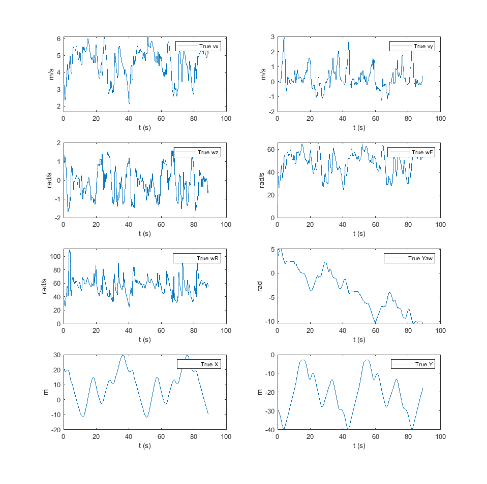

  
  

## Methods
Our project took the following approach to classifying whether the autorally car should turn left, right, or go straight:

1.  Generate a reduced representation of the road scene by segmenting the road from the image. A car's traversable space is limited by the shape of the road they're on, so we figured the **road map** would provide clear training data for a neural network.
    
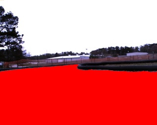

2.  Use dynamics data to label each image as going left, right, or straight. This is done by filtering and thresholding the vehicle's yaw velocity at the time each image was captured to determine the direction the car was turning.
3.  Train a neural network on the labelled images to classify the segmented road maps to the correct road segment types (right turn, straight, or left turn).

## Road Segmentation
Road detection can be a difficult problem since the appearance of roads vary depending on lighting conditions, road texture, and the presence of obstacles. The AutoRally data provided us a simplified scene to work with: the images were taken during daytime on a dirt road with no obstacles.

We looked to two clustering algorithms to help us segment the road from the image: DBSCAN and K-Means clustering

### DBSCAN Approach
We started by trying the [DBSCAN clustering algorithm](https://scikit-learn.org/stable/modules/generated/sklearn.cluster.DBSCAN.html) on the road images. One of the advantages of DBSCAN is that it can determine the number of clusters on its own. This could be helpful in generalized road detection algorithms since we can't always expect there to be consistent lighting conditions.

This is the overall algorithm we used:
1.  Pre-processing
    * Crop the image to its bottom 2/3rds to ignore the sky and focus on the road.
    * Apply histogram equalization to make the road stand out from the road edges and car hood.
    * Blur the image to even-out the rocky appearance of the road
    
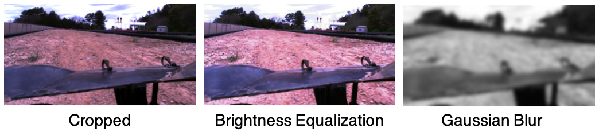

2.  Run DBSCAN to get cluster labels. We used the 3rd largest distance from a [K-NN](https://scikit-learn.org/stable/modules/generated/sklearn.neighbors.KNeighborsClassifier.html) search for DBSCAN's epsilon parameter.<a href="#ref1">[1]</a>
    
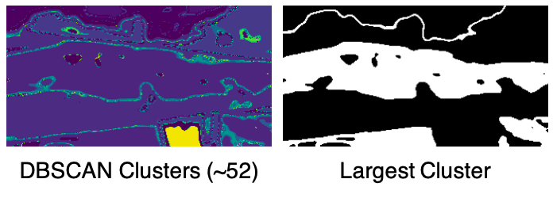

3. Use connected component analysis and a 2D Gaussian to select the cluster that has many points in the center of the image, where we assume the road to be.

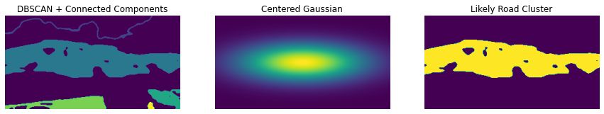

### Results
Despite our pre-processing steps and DBSCAN parameter tuning, we found the clusterings produced by DBSCAN to still be too sensitive to road aberrations like grass and rocks, and sometimes the road wouldn't be selected.

  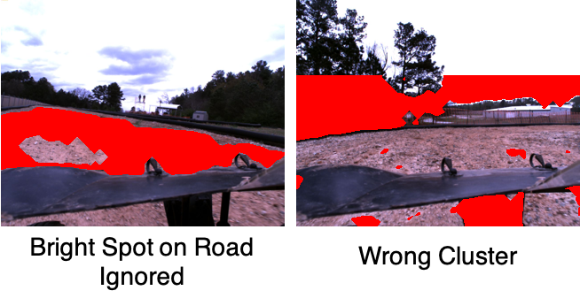

Roughly half the road maps would have errors, so we looked to using K-Means

## Road Segmentation Using K-Means
To apply K-Means clustering to the road segmentation problem, we made the guiding assumption that (1) light areas are sky, (2) dark areas are the car hood or road edges, and (3) midtones contain the road. This assumption is reliant on consistent lighting conditions, so it's not generalizable to most road detection problems. For the specific data we have though, it allowed us to perform the clustering with K=3.

1.  Apply Gaussian Blur to smooth the road
2.  Run K-Means clustering on the RGB image with K=3.
    
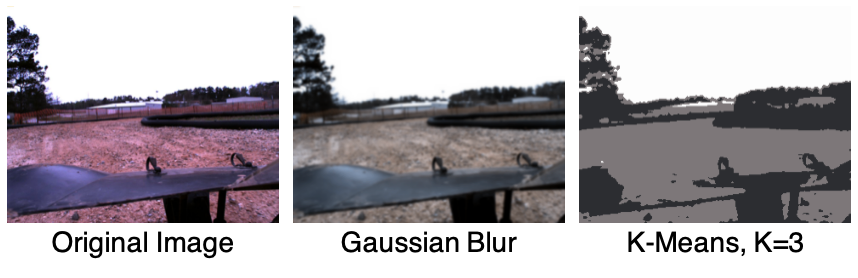

3.  Assuming the midtone contains the road, extract it with a mask, and perform binary opening and closing to disconnect thin regions.
    
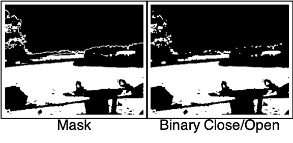

4.  Apply connected component analysis and select the largest cluster as the road. Apply further connected component analysis and flood-filling to fill in gaps in the road.
    

### Results
Compared to DBSCAN, only about ~2% of the road maps generated by K-Means had errors in the chosen cluster. Therefore, we used this data in our neural network.

## Road Segmentation Using Regularaized Learning
Predicting the road segmentation is important in real time application, as it projects a future planning space for the autonomous vehicle to plan and control. We trained our ridge regression model with the road labels produced by the K-Means and the post-processing techniques presented above to predict road segmentation within a short period of time, given the dynamics of the vehicle and the input camera image. The state and control are concatenated together with the pre-processed image to formulate the input to the regression model, and the road labels obtained above are used as ground truth for supervised learning. The pre-processing of image includes:

1. Apply Gaussian Blur to smooth the road.
2. Convert to black and white image.
3. Apply principal component anlaysis to attain 99.5% variance.

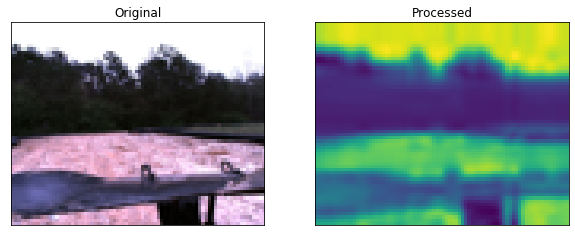

The state includes longitudinal velocity, lateral velocity, yaw rate, yaw position, global x position, and global y position. The control includes
the steering angle and the wheel speed. The closed formulation of ridge regression was used to obtain the weight of the ridged regression. A cross validation with k-fold was run over a series of regularization variables to find a good value. We trained with 50% of the available AutoRally data, and 10-fold was used among the training data set for the cross validation. The resulting weight is used to predict the road labels with given input consisting of the preprocessed image, state and control.

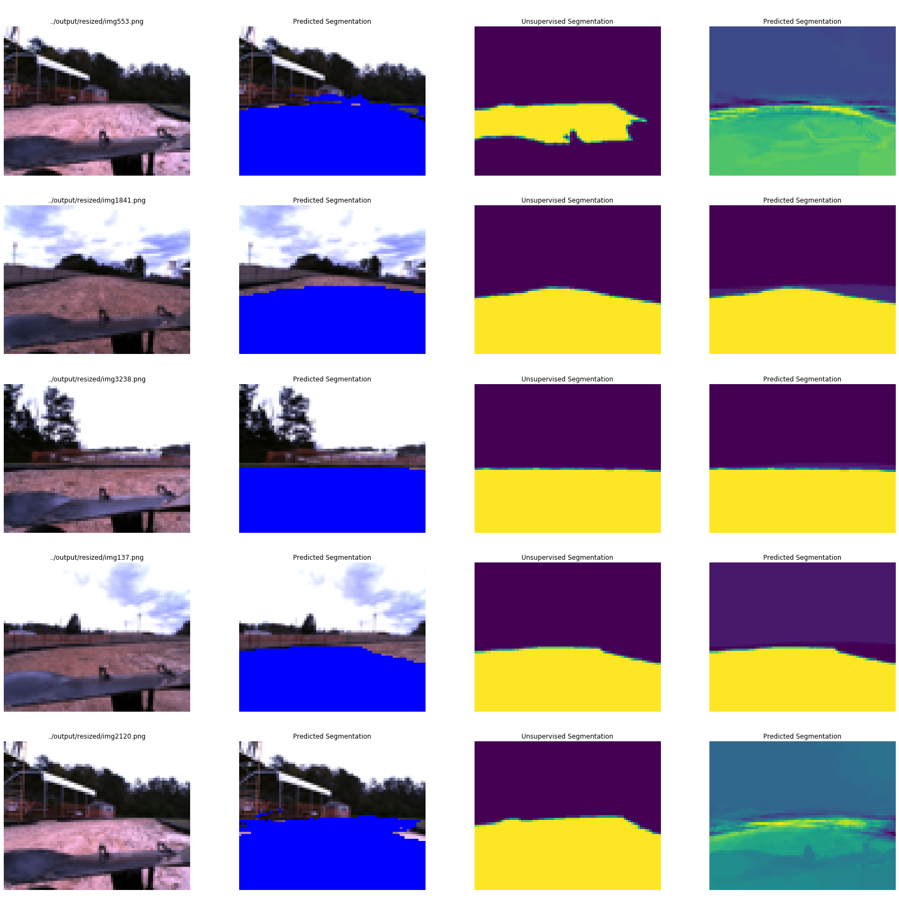

The predicted road segmentations are overlayed on top of the input image, and the predicted road maps alone are plotted next to the ground truth obtained with the unsupervised learning. 

### Regression without dynamics 
The camera image soley was used to train the same regression model without the dynamics to emphasize the importance of dyanmics. The same preprocessing and the same regularization parameter, and the same training data set were chosen. However, the predictions were poor in general. This tells that the dynamics of the vehicle contains crucial information of the environment it learns. 

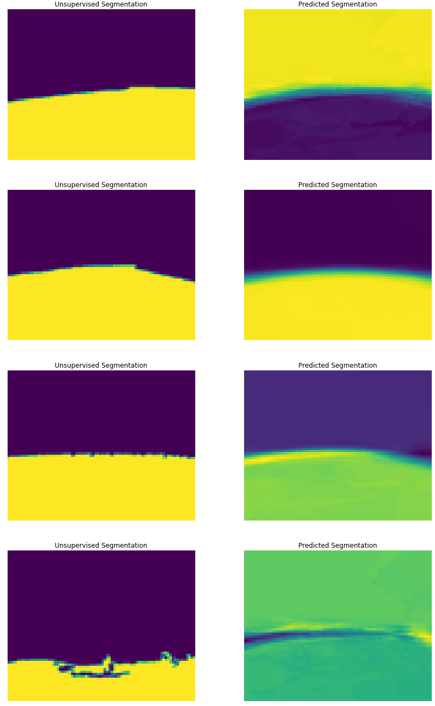

## Supervised Turn Classification

### Ground Truth Labels Generation

Labels for the training and validation datasets were generated automatically using the vehicle states information accompanying the images. We filtered the vehicle's yaw velocity and then thresholded it to fall into one of three classes: right turns, straights, or left turns. The thresholded yaw velocity at the time each image was captured was used to provide the image labels for supervised learning. The classifications along with the measured yaw orientation are displayed below.

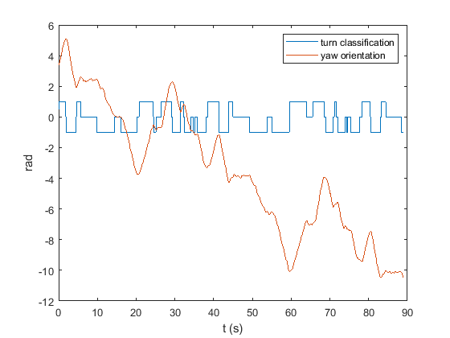

### Decision Tree Classification

We started by using decision trees to conduct image classification on the segmented road map images. The decision tree recognizes every pixel as a feature for its tree generation process. This has turned into one of the main reasons that deciisions trees may not perform well in image classification problems. The library used was sklearn where tree has min_samples_split as a parameter to determine the minimum number of samples to split a leaf. The value assigned here is min_samples_split = 30, after trying multiple values. The output from this tree is a label (straight, right, or left).

## Results

The decision tree achieved only a 37.15% accuracy, which is not good. Thus, the team has decided to move with more sophisticated classifiers such as Neural Networks to achieve better results. The figure below shows a random a sample of the results.

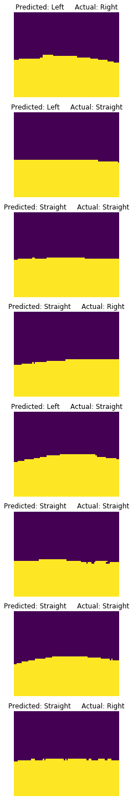

### Neural Network Architecture

We chose to use a neural network to perform image classification on the segmented road map images. Since we have already generated our feature information in the form of the segmented roadmap, our neural network only needs to map the spatial information to the three possible labels (left turn, straight, right turn). Therefore we elected to use a series of fully connected layers to map the segmented pixel locations to the three categories. We also used one max pooling layer to reduce the image dimensionality and the number of learnable parameters in our network to speed up training. In the figure below, all intermediate fully connected layers are followed by a ReLU activation function. We also show the input and output dimensions for each layer.

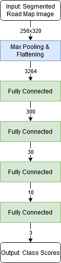

The output class scores are then fed into a softmax function for training which assigns a probability of the image belonging to each of the three classes based on the relative weight of the scores. This allows the gradient to be backpropagated through all three output channels. For validation, we simply take the argmax of the three output channels to determine the most likely class the image belongs to.

### Results
#### Training and Validation Accuracy

We trained the network for 20 epochs using the Adam optimizer using a cross entropy loss function. The cross entropy loss incorporates softmax which assigns a probability of the image belonging to each class based on the relative scores of the three output channels. The optimier then adjusts the layer weights to maximize the relative scores of the correct classes. We reserved one third of our dataset for validation to prevent overfitting, and plotted the training and validation accuracies for each epoch. We reach about 96% accuracy on the training data and 87% on the validation set.

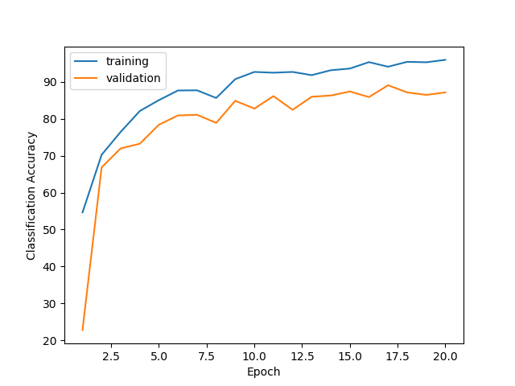

#### Validation Examples

We demonstrate the classification results on a sample of validation images. Although the network takes the segmented images as the inputs, we display the raw, unsegmented images for easy visual inspection. The predicted and ground truth labels are displayed for each image. There is one failure case in these examples where a straight was incorrectly labeled as a right turn.

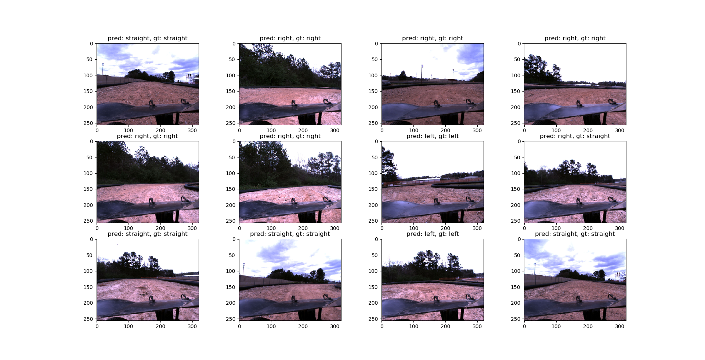

## Conclusion

## Group Member Contributions

### Abdulaziz Qwbaiban

### Jacob Knaup

 * Prepare dataset images and state data
 * Generate labels for training neural network
 * Implement classification neural network in PyTorch
 * Evaluate neural network performance and prepare write-up

### Jaein Lim

### Phong Tran

## References.
1. <a id="ref1" href="https://iopscience.iop.org/article/10.1088/1755-1315/31/1/012012/pdf" style="display: inline">Determination of Optimal Epsilon Value on
DBSCAN Algorithm to Clustering Data on
Peatland Hotspots in Sumatra</a>
